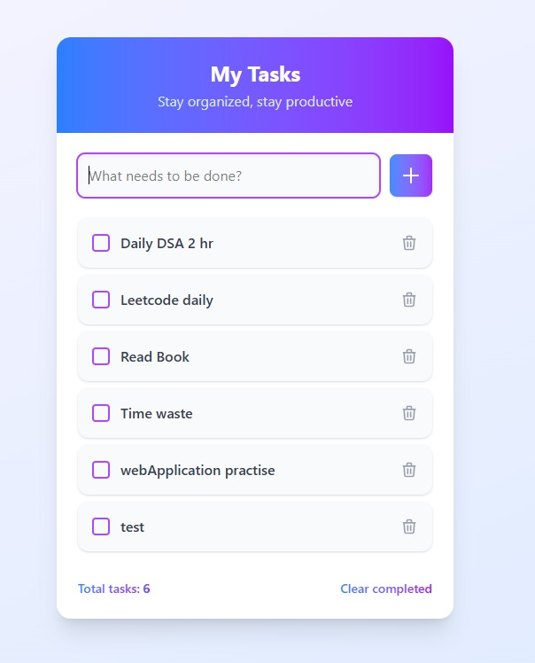

# TaskiFy 📝  
**A Minimal Task Manager App Built with Vanilla JavaScript & Tailwind CSS**

TaskiFy is a clean, responsive, and easy-to-use task management application that helps you organize your day with simplicity. Built entirely with **HTML**, **Tailwind CSS**, and **JavaScript**, this project emphasizes dynamic DOM manipulation without using any external frameworks.

---

## 🔥 Features

- ✅ Add new tasks easily  
- ✏️ Mark tasks as completed/incomplete  
- 🗑️ Delete tasks with one click  
- 🧹 Clear all completed tasks  
- 📊 Live task counter  
- 💻 Responsive and modern UI with Tailwind CSS  
- ⚡ Built using vanilla JavaScript (pure DOM manipulation)  

---

## 📸 Preview

Here are some screenshots of TaskiFy in action:

### Clean Task List View


### Marked Tasks View


---

## 🛠️ Tech Stack

- **HTML5** – Markup structure  
- **Tailwind CSS** – Styling and responsive design  
- **JavaScript (ES6+)** – Functionality and DOM manipulation  


## 🚀 Getting Started

Follow these steps to use TaskiFy locally:

1. **Clone the repository**
   ```bash
   git clone https://github.com/shakilahamedriaz/TaskiFy.git
   cd TaskiFy
